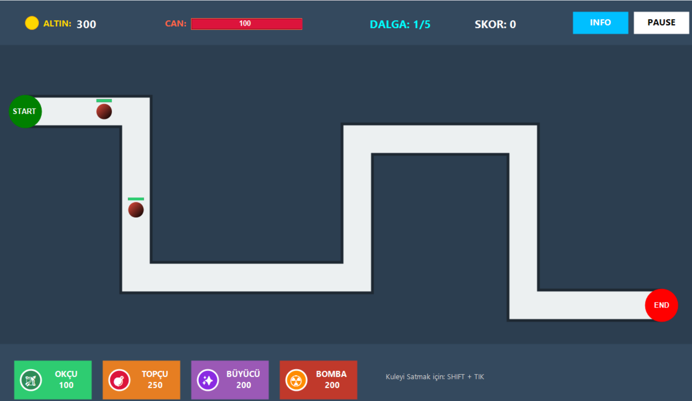

# 🎮 Modern Kule Savunma Oyunu (C# NDP Projesi)

Bu proje, Sakarya Üniversitesi Bilişim Sistemleri Mühendisliği **ISE-102 Nesneye Dayalı Programlama (NDP)** dersi kapsamında geliştirilmiş, strateji tabanlı bir kule savunma simülasyonudur.

## 🛠️ Uygulanan NDP Prensipleri (Mühendislik Mimarisi)
Proje, değerlendirme kriterlerinde yer alan tüm nesne yönelimli programlama kavramlarını eksiksiz içermektedir:

* **Abstract Class (Kule.cs):** Tüm kule türlerinin (Ok, Top, Büyü) ortak temel özelliklerini (hasar, menzil, hız, fiyat) ve metotlarını barındıran temel sınıftır.
* **Inheritance (Kalıtım):** Ok, Top ve Büyü kuleleri, temel `Kule` sınıfından türetilerek kod tekrarı önlenmiş ve hiyerarşik yapı kurulmuştur.
* **Polymorphism (Çok Biçimlilik):** Her kule sınıfı, kendine has saldırı mekanizması (tek hedef, alan hasarı veya çoklu hedef) için `Saldir()` metodunu override eder.
* **Interface (Arayüz):** `ISaldirabilir` ve `IYukseltilebilir` arayüzleri kullanılarak nesnelere esnek yetenekler kazandırılmıştır.
* **Encapsulation (Kapsülleme):** Field'lar `private` tutulmuş, verilere erişim kontrollü `public property` yapıları üzerinden sağlanmıştır.

## ⚔️ Oyun Mekanikleri
* **Kule Stratejileri:** Menzil ve hasar dengesi farklı olan 3 ana kule tipi (Ok, Top, Büyü).
* **Dinamik Dalga Sistemi:** Her dalgada zorlaşan, daha hızlı ve dayanıklı düşman akınları.
* **Gelişmiş UI:** Üst panelden anlık Altın, Can, Dalga ve Skor takibi.

## 🚀 Kurulum ve Çalıştırma
1. **ModernKuleSavunma.sln** dosyasını Visual Studio ile açın.
2. Gerekli kütüphanelerin yüklendiğinden emin olun.
3. Projeyi **Build** edip çalıştırın.

---
© 2025 - İsmail Alpak | Sakarya Üniversitesi Bilişim Sistemleri Mühendisliği
